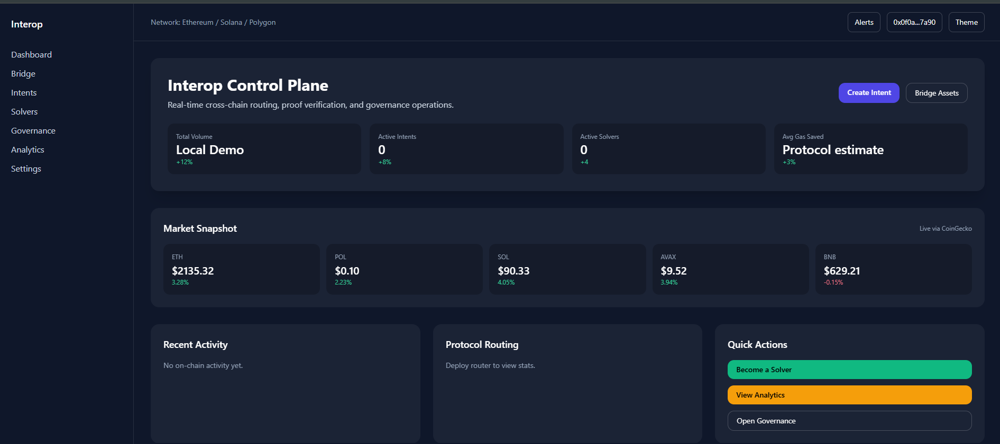
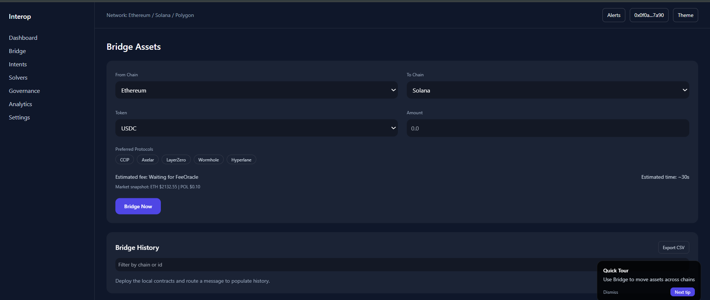
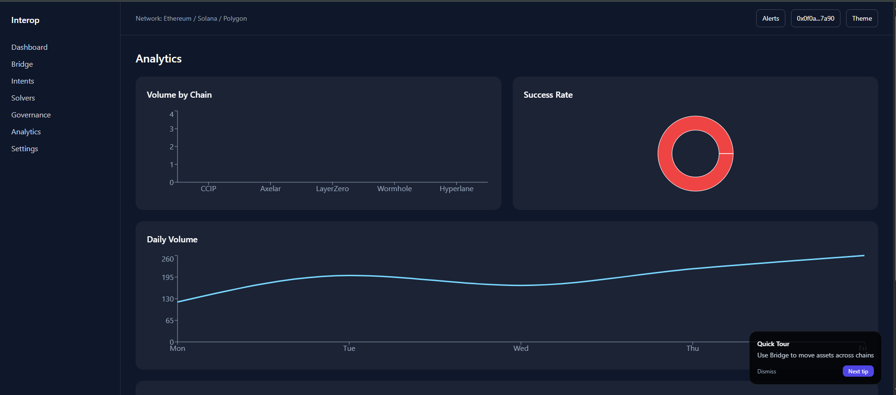

# Interop System

[](https://github.com/AsfahanJaved328/interop-system/actions/workflows/ci.yml)
[](https://interop-system.vercel.app)
[](https://sepolia.etherscan.io/)

Interop System is a cross-chain interoperability platform that combines:
- protocol routing across multiple bridge/message adapters
- intent-based execution flows with EIP-712 signing
- light-client assisted verification primitives
- governance, analytics, and operator tooling
- a public Next.js dashboard connected to Sepolia deployments

## Live Links
- Public app: [https://interop-system.vercel.app](https://interop-system.vercel.app)
- GitHub: [https://github.com/AsfahanJaved328/interop-system](https://github.com/AsfahanJaved328/interop-system)

## Product Preview
### Dashboard


### Bridge


### Intents


### Analytics


## What It Is Useful For
- Demonstrating a cross-chain interoperability stack to clients, teammates, or investors
- Testing router, intent, and adapter flows on Sepolia
- Showcasing a protocol dashboard with bridge, analytics, governance, and solver views
- Serving as a foundation for a larger bridge or intent-based DeFi product

## Current Status
- Backend contracts implemented and tested
- Frontend deployed publicly on Vercel
- GitHub Actions CI passing
- Core contracts and adapters deployed to Sepolia

## Sepolia Deployment
- Router: `0x53A0fdF4C5E9c3A1B230DC2D16b26D7c63612737`
- FeeOracle: `0xd981c1e33959093fbcF77cf815B09fA0B5316851`
- IntentContract: `0xC5F5BAa7bdF3d062a6306a89Dd2a6137b5EA1aAC`
- Axelar Adapter: `0x6Fc30F36f36c438E40C01c474Dc2099AB521224C`
- LayerZero Adapter: `0x15DC2513833FFC17076F8079Fc885bc623A1bFc1`
- Wormhole Adapter: `0xC54f30E4c008DEdFB2d68b972A4e63283A74a5b5`
- Hyperlane Adapter: `0xA601B9D5456fd8C03414C4fdbE7680ec01b28f38`

## Repository Structure
- `contracts/` Solidity contracts and adapters
- `test/` Hardhat and Foundry tests
- `frontend/` Next.js public app
- `docs/` architecture, protocol, runbook, and handoff docs
- `sdk/` integration SDK scaffold
- `subgraph/` indexing scaffold
- `devops/` monitoring and deployment infrastructure

## Local Development
```bash
npm install
npm test

cd frontend
npm install
npm run dev
```

## Deployment Flow
```bash
npm run deploy:testnet:preflight
npm run deploy:testnet:full
npm run promote:testnet-env

cd frontend
npm run build
```

See also:
- [docs/RUNBOOK.md](docs/RUNBOOK.md)
- [docs/SAFE_DEPLOYMENT.md](docs/SAFE_DEPLOYMENT.md)
- [docs/PROJECT_SUMMARY.md](docs/PROJECT_SUMMARY.md)

## Screenshot Assets
Current captures are stored in:
- [docs/screenshots/dashboard.png](docs/screenshots/dashboard.png)
- [docs/screenshots/bridge.png](docs/screenshots/bridge.png)
- [docs/screenshots/intents.png](docs/screenshots/intents.png)
- [docs/screenshots/analytics.png](docs/screenshots/analytics.png)

## Notes
- The public site is connected to Sepolia testnet, not mainnet
- The exposed test wallet used during setup should be rotated after testing
- This is a strong testnet-ready interoperability product foundation, not yet a full retail production bridge
