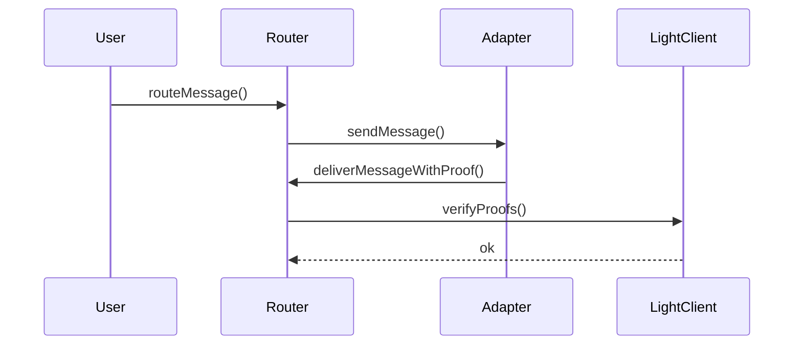
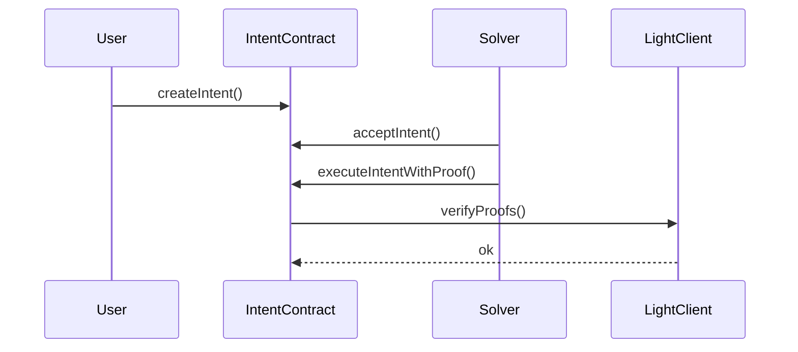

# Sequence Diagrams

## Cross-Chain Message

```mermaid
sequenceDiagram
  participant U as User
  participant R as Router
  participant A as Adapter
  participant LC as LightClient
  U->>R: routeMessage()
  R->>A: sendMessage()
  A->>R: deliverMessageWithProof()
  R->>LC: verifyProofs()
  LC-->>R: ok
```

## Intent Execution

```mermaid
sequenceDiagram
  participant U as User
  participant I as IntentContract
  participant S as Solver
  participant LC as LightClient
  U->>I: createIntent()
  S->>I: acceptIntent()
  S->>I: executeIntentWithProof()
  I->>LC: verifyProofs()
  LC-->>I: ok
```
